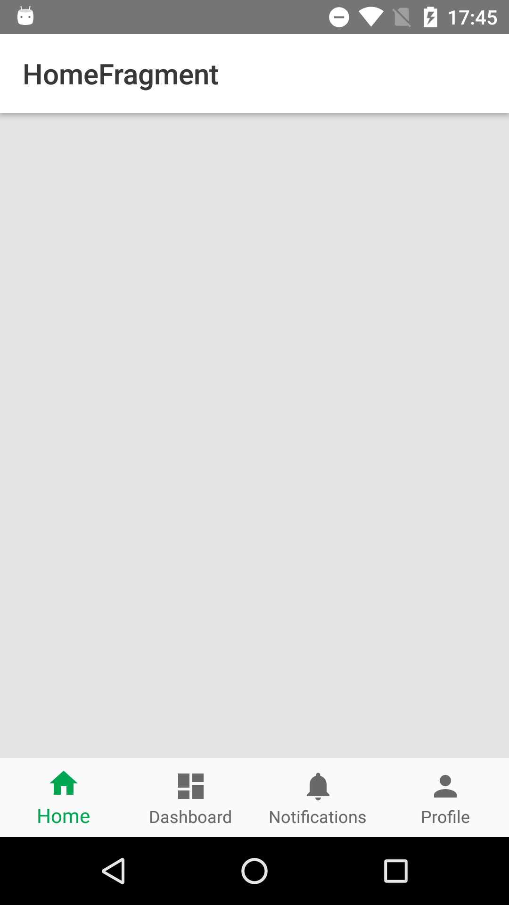

# Bottom Navigation
This application is example of how to use [BottomNavigationView](https://developer.android.com/reference/android/support/design/widget/BottomNavigationView.html).
* This app is implemented in Kotlin
* Disable BottomNavigationView shift mode.  


## Prerequisites
* Android SDK 27
* Android Build Tool 27.0.3
* Android Support Repository 27.1.1
* Android Plugin for Gradle 3.1.4
* Kotlin v1.2.30

## Getting Started
Build with Android Studio 3.1.3

### ProGuard
You need to configure proguard-rules.pro file if you want use ProGuard. Such as below:   

```
-keepclassmembers class android.support.design.internal.BottomNavigationMenuView { 
    boolean mShiftingMode; 
}
```
